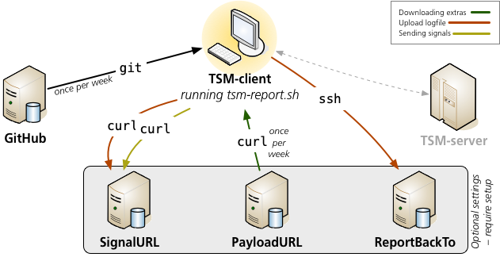

# Installing tsm-report.sh
Overview of the components:

**In short:**

1. The script checks for a new version with GitHub once per week (and auto update itself). *(This is default but can be turned off)*
2. *Require setup:* at runtime, sends various signals to a web server (`SignalURL`) informing on how things are going
3. *Require setup:* once per week, it checks for new/modified content to download from a web server (`PayloadURL`)
4. *Require setup:* once per run of the script, it checks with the web server at `SignalURL` and if there's a file with the name of the client, it transfer the TSM log file to a `ssh`-server specified by `ReportBackTo`
5. The client computer communicates with the TSM-server, but the report script doesn't concern itself with that. It's included in the image for the sake of completeness

I use the same server for `SignalURL`, `PayloadURL` and `ReportBackTo`, but you may of course have different computers for each of those.

-----

## Installation:

1. Download or clone this repository
2. As a convenience: create a symlink to the script somewhere on `$PATH`, like `/usr/local/bin`
3. Create the directories `/TSM` and `/TSM/DailyReports` and make sure the user who is going to run `tsm-report.sh` can write in those directories. In the former directory, payload files are stored, and in the latter, local reports are created daily for the convenience of the user. Those files are kept for 30 days
4. Add the script (or the link) to `cron`, such as `*/10 * * * * /usr/local/bin/tsm-report.sh`. This is needed for the auto-update functionality
5. On Windows, the script will only run automatically if:
   * WSL (Windows Subsystem for Linux) is running and
   * `cron` is running. I suggest to put `service start cron` in `.profile`
   * To make WSL start when you log in to Windows, you can take [this VBS-script](https://gist.github.com/leonelsr/cde77574519eb1fd672bc9690e01257e) and store it in `C:\Users\my-user-name\AppData\Roaming\Microsoft\Windows\Start Menu\Programs\Startup`
6. If you want to be able to have log files sent “back home”, read the section ”In detail: Upload functionality” below
7. If you want to download extra files (“payload”), read the section ”In detail: Downloading extras” below
8. If you want to use “signals”, read the section ”In detail: Sending signals” below

**Optional settings:**

The script uses an optional settings file, `/etc/tsm-report.settings`, that can change the default settings if present. Full detail are further below. The following content is recognized:

*  `PayloadURL="https://machine1.pretendco.com/some/path"`.  
   This is where optional files reside, such as documentation in PDF format.
*  `ReportBackTo="machine2.pretendco.com"`.  
   This is used to transfer a log file in case the TSM admin wants to look at it. 
*  `ReportBackUser="username"`.  
   This is the username that will be used to log into `ReportBackTo`
*  `SignalURL="https://machine3.pretendco.com/some/path"`.  
   This is the URL that is used to send “signals” back to the the server  
*  `AutoUpdate`. Governs weather the script will auto-update.  
   Setting `AutoUpdate` = `""` will make the script NOT automatically update itself (default is `"t"`)
*  `GrowlNotify="/usr/local/bin/growlnotify"`  
   If you run on macOS and utilize the [Growl](http://growl.info), this is used to both signal to the script that Growl is used, and where its command line part, `growlnotify`, is located.  
   *(Note that in order to utilize `grownlotify`, Growl.app must be running!)*
*  `GrowlSticky="-s"`  
   With this flag set, it makes the message not dissappear after 10 seconds (which is ideal for servers)

-----

**_In detail:_ Downloading extras**

First, configure `PayloadURL` in the settings file. It should be a valid URL, specifying a directory where the downloadables are to be found. In this directory a file called `payload.txt` must exist. It consists of a number of lines, each specifying a file in the same directory to be downloaded. Replace spaces in the file name with `_` (they will be swtched back when they have been downloaded to the client).  
Example content:  
`How_to_restore_files_from_the_TSM_backup.pdf`  
`About_the_TSM_Backup.pdf`  
`Deselect_files_from_the_TSM_Backup.pdf`  
`How_to_restore_files_from_the_TSM_backup_using_CLI.pdf`  
For verification of correct transfer, every file must have an accompanying file containing the `sha1`-checksum. The name of this checksum file must be the same, but with `.sha1` added at the end. Thus the file `About_the_TSM_Backup.pdf` has an accompanying file `About_the_TSM_Backup.pdf.sha1` containing its checksum. 

That means that every time you make a change to these files, a new checksum must be created. This can easily be done with a simple script containing something such as:  
`for i in *[!.sha1]`  
`do`  
`  openssl sha1 "$i" | awk '{ print $2 }' >"$i".sha1`  
`done`  
Since I rarely change these files, I have made a script to create these checksum-files that I run manually every time I have updated the files.

-----

**_In detail:_ Upload functionality**  
If you want `tsm-report.sh` to be able to upload files, both the client machine and the recieving server needs to be set up. To initiate the transfer, the web server at `SignalURL` must be prepared as well. 

This is done using `ssh`. But since I don't want to create an open security hole, we will replace `/usr/bin/bash` as the log in shell with a custom one. Thus, a bad guy can't actually log in to the report-server from outside.

The following is a list of the steps involved:  

1. On the recieving machine, `ReportBackTo`, create a local user with as low priviliges as possible
2. Create a shell script that will later be used as login shell for this user, for instance `/usr/local/bin/skal.sh`  
   This script will take `stdin` from `ssh` and store it in a location. It can be as simple as this:  
   `#!/bin/bash`  
   `FileName="$@"`  
   `# Remove leading '-c ' so it doesnt become a part of the filename (it comes from being a login shell)`  
   `cat - > "$(echo $FileName | sed -e 's/^-c //')"`  
   `exit 0`    
   You might, however, make it as elaborate as you like, for instance dealing with transportation of new public keys to be stored in `.ssh/authorized_keys` (you can no longer transport them with `ssh-copy-id`), storing of files in different places depending on names, dates etc. You can use the environment variables declared in `authorized_keys` for that
3. Make sure that `sshd` is active on that machine and that the firewall(s) are opened for `ssh`
4. On the client, add `ReportBackUser="username"` and `ReportBackTo="machine2.pretendco.com"` to the settings file (`/etc/tsm-report.settings`) using proper values, of course
5. Also on the client, create a `ssh`-key as the user who will be running `tsm-report.sh` using `ssh-keygen -t rsa` or `ssh-keygen -t ed25519`
6. Upload this key to the `ReportBackTo`-server with `ssh-copy-id username@machine2.pretendco.com`.  
   *(If you have already employed the script in step 2 above, you will have to find another way to transport the key)*
7. Back on the `ReportBackTo`-server, set the shell of the user you created in step 1 to be the script you created in step 2  
   Note that you will no longer be able to log in through `ssh` as that user! You may, or may not, be able to log in in the GUI as that user (it works on macOS)
8. This is not nessecary, but can be useful in your script: edit the appropriate entry in `~user/.ssh/authorized_keys` to start with `ENVIRONMENT="REMOTEUSER=something"`. You can use this variable in the script you created in step 2 to make different things happen to different clients!
9. On the web server specified by `SignalURL`, create a subdirectory called `send_home`. For every host that you need to send it's `dsmsched`, create an empty file in this directory with the name of the client computers TSM-`NODENAME`. The presence of this file will trigger the transfer of the `dsmsched`-log to the `ReportBackTo`-server. Transfer will happen once per day as long as the signal file exist.  
   Depending on the successful file transfer, either the signal `send_home_ok` or `send_home_not_ok` will be sent to `SignalURL` along with the `ClientName`. You may want to harvest those signals.

*Technical explanation:*  
In `tsm-report.sh`, file transfer is done in the following way:  
`ssh username@machine2.pretendco.com "${LogFile}_${ClientName}_${Today}.txt" < "$LogFile"`  
(`ClientName`, `username` and `machine2.pretendco.com` having “real” values).  
This will transfer the file `/Library/Logs/tivoli/tsm/dsmsched.log` to the host `machine2.pretendco.com` as user `username` and store it with the name `dsmsched_peter_2019-04-16.txt` in that users home directory.

I *strongly* suggest that you try this functionality manually before you employ `tsm-report.sh`!

-----

**_In detail:_ Sending signals**

If you want to send signals home, configure `SignalURL` in the settings file to be a proper URL where you create empty files whose access will tell the operator something about the client. These files don't *need* to exist, but it's nicer to get a status code of `200` in the web server log rather than `404` (which will also contaminate any web log analysis).  
The signal is sent by making a `curl`-request for the specified “signal”. The name of the client will be included in the call. Available signals are:

* `dsmcad_not_running`: informs that the backup daemon is not running
* `send_home_not_ok`: sending of the `dsmsched`log file was not successful
* `send_home_ok`: sending of the `dsmsched`log file was successful
* `tsmreport_updated`: informs that the script has been updated
* `wrong_dateformat`: informs that `DATEFORMAT` is not `3`
* `no_report_dir`: informs that the report directory `/TSM/DailyReports` doesn't exist and couldn't be created

To be useful, this requires some work at that server to “harvest” these signals. You need a simple script that look at the web server log file to see which client accessed which signal file. Example of such a line in an apache-log file:  
`client.pretendco.com - - [05/Sep/2018:07:30:07 +0200] "GET /some/path/dsmcad_not_running HTTP/1.1" 200 - "peter" "curl/7.30.0"`  
You can see day, time, what signal (`dsmcad_not_running `) and which client (`peter`) in this call.
