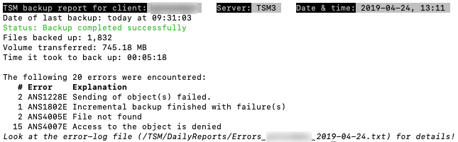
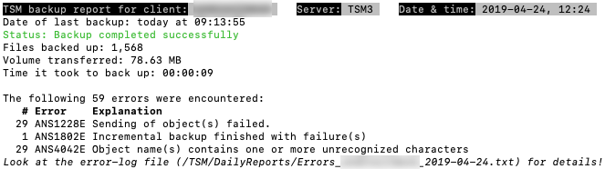
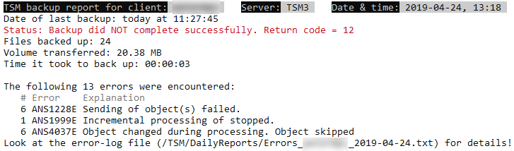

# tsm-report.sh
A bash-script that gives a report of the TSM-backup on a TSM-client computer [running UNIX].  
It does this by digging through the log file that the backup process produces.

-----

## Features

### Basic features:
* Multi-platform: **macOS**, **Linux** and **Windows 10** *(with “WSL” — “Windows Subsystem for Linux”)*
* Generates a daily report specifying:
  *  number of files backed up
  *  volume transferred
  *  errors
  *  time consumed
* Create daily “convenience reports” for the benefit of the local user and store those for 30 days in a local directory:
  * all scheduled activities during the day
  * a list of all errors that occurred
  * a list of large files (>10 MB) that were backed up during the day
* A daily one line entry in a “diary file” specifying what happened
* Automatically updates itself every 7 days (can be turned off)

### Optional features:
* Download auxilliary files, such as PDF-documentation, from a server to the local machine. This is done using `curl` wich checksum verification
* Send the daily report back to a server in case the TSM operator needs to look at the details of the backup but cannot get to the client (done with `ssh`)
* Send various “signals” to inform the TSM operator of various issues on the client. This is done using `curl` to a specified host and includes the TSM-client name.  

### Checks perfomed at runtime:
* that the report script isn't already running
* that the backup daemon (`dsmcad`) is running and warns if not (does **not** work on Windows!)
* that the log file is readable
* if the script is added to `cron` of the running user and warns if not (links will be resolved)
* that the report directories exist. Tries to create them if not
* that the `DATEFORMAT` is set to `3` (YYYY-MM-DD). The script will quit with an error code if not

-----

**Requirements:**

* `DATEFORMAT` needs to be `3` for this reporting to work ([ISO 8601](https://en.wikipedia.org/wiki/ISO_8601); YYYY-MM-DD). This is set in the `dsm.opt`file

-----
## Screen shots:

**macOS:**  

**Linux:**  

**Windows 10:**  

